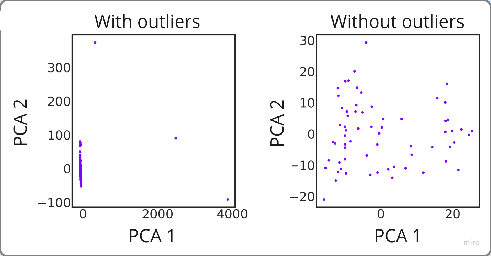

### Getting data from raw RNAseq
For Illumina RNAseq, the pipeline of getting required data format is as follows, starting with raw fastq files: 

1) Perform pseudo-alignment of QC-checked reads with [Kallisto](https://pachterlab.github.io/kallisto/) v0.42.4 to [GENCODE v23 transcripts 69](https://www.gencodegenes.org/human/) .

   Build index:
   
```bash
wget https://ftp.ebi.ac.uk/pub/databases/gencode/Gencode_human/release_23/gencode.v23.chr_patch_hapl_scaff.transcripts.fa.gz
kallisto index -i gencode_v23.idx gencode.v23.chr_patch_hapl_scaff.transcripts.fa.gz
```


   The example command to align, starting in folder with paired-end fastq.gz files (for 1 sample) may be: 
```bash
kallisto quant -i gencode_v23.idx -o your_output_dir --paired-end RNASeq_tumor_reads_1.fastq.gz RNASeq_tumor_reads_2.fastq.gz
```
Note that for single-end reads the flag is "-single". This step will produce TPMs in the file abundance.tsv in folder your_output_dir.

2) Perform reads quality control (QC) [FastQC](https://www.bioinformatics.babraham.ac.uk/projects/fastqc/) v0.11.5, [FastQ Screen](https://www.bioinformatics.babraham.ac.uk/projects/fastq_screen/) v0.11.1, [RSeQC](http://rseqc.sourceforge.net/) v3.0.0 (optionally with STAR alignment and resulting bam) using [MultiQC](https://github.com/ewels/MultiQC) v1.6.

   The example command, starting in a directory with fastq.gz files may be:
```bash
fastqc .fastq.gz # read quality control
fastq_screen *.fastq.gz # read quality control
multiqc . # beautiful summary of results
```
	

Here, we pay attention to: 
- A-T and G-C ratio, which needs to be almost equal at positions starting from ~20bps;
- Duplicated sequences number - PCR fragments;
- Phred score >30;
- Contamination data (from rRNA, non-target genome regions, and other organisms);
- Using Kallisto: target RNA reads should be >10M; % of protein-coding reads should be >80%.
  
In general, low quality sample has a multihit of several QC metrics. The additional option is to not perform QC sample-wise, if one is limited in sample size, but read-wise, and discard low-quality read. Additionally, we perform other QC analyses, which are the same as for microarray or processed RNAseq data.

3) Transform to logTPM:
Python example of transforming abundance.tsv for one sample:

```python
import pandas as pd
import numpy as np

#functions from basicqc.py 
from projects.Immune_Escape.functions.basicqc import target_transcripts, parse_target_id, recalculate_tpm, check_log_scale

kallisto_output = pd.read_csv('abundance.tsv', sep='\t')

kallisto_output[['ENSEMBL_ID','HUGO_Gene', 'Transcript_Type']] = kallisto_output['target_id'].apply(lambda x: pd.Series(parse_target_id(x)))
result_for_qc = kallisto_output[['ENSEMBL_ID','HUGO_Gene', 'Transcript_Type', 'tpm']] # resulting df for checking QC with kallisto, check QC_example notebook

result_logTPM_series = result_for_qc[(result_for_qc.ENSEMBL_ID.isin(target_transcripts))].groupby('HUGO_Gene').tpm.sum()
result_logTPM_series = recalculate_tpm(result_logTPM_series)

result_logTPM_series = check_log_scale(result_logTPM_series) #Resulting series used in analysis for the sample

result_for_qc.to_csv('kallisto_pseudocounts.tsv', sep='\t') # saving data for QC based on kallisto pseudocounts (example file in test_data/QC_example_SKCM_HugoMAPK2_GSE75313/kallisto_pseudocounts.tsv)
result_logTPM_series.to_csv('kallisto_tpm.tsv', sep='\t') # saving data for QC based on TPM values, applicable for both RNAseq and microarray expression dataframes (example file in test_data/QC_example_SKCM_HugoMAPK2_GSE75313/kallisto_tpm.tsv)
```
	

### Getting data for microarray or processed RNAseq
The tutorial on how to download and process microarrays is in the [notebook](https://github.com/BostonGene/MFP/blob/master/GEO_data_retrieval.ipynb) for the [Molecular Functional Portraits](https://pubmed.ncbi.nlm.nih.gov/34019806/) paper. 

For the processed Illumina RNAseq, it's important to convert values to logTPMs. If transcripts aren't in the HUGO gene format (for example, in Ensembl IDs), use GENCODEv23 annotation to convert and sum by protein_coding trancripts, then convert to logTPM.

For microarray data, if not in the HUGO format, we propose the same approach -- map to HUGO using GENCODEv23 annotation, afterwards, get mean score and log-normalize.

### Additional QC
We additionally check batch effect, outliers, overall data quality via distribution, expression scores correlation for the cohorts. Please see [test_data/QC_example_notebook.ipynb](test_data/QC_example_notebook.ipynb) for the tutorial. 

#### Batch effect

We define batch effect as a systematic difference between sample groups. You can refer to a corresponding notebook section to identify it in your data.

Sources of batch effect include technical differences (from sample preparation and chosen technology to quantification methods), quality differences, sequencing depth and so on. But batch effect can also be explained by biological difference — different diagnoses, sample sources, confounding factors, and in case of tumor tissue — evolution. However, our work is done with a premise that relative TME cell abundances are consistent between diagnoses, different metastatic locations and different parts of biopsy sample. That's why we identify and harmonize between them even if they are in fact biological.

We use dimensionality reduction methods to address batches - [UMAP](https://umap-learn.readthedocs.io/en/latest/) and PCA, on logTPMs or log-intensities. 

|          |
| -------------------------------------------------------------- |
| *Batch effect example with UMAP, log(expression scores) space* |
#### Outliers

We identify outliers as samples noticeably different or distant from the other observations. The good marker for outliers is if other QC metrics are also showing sample low quality. 

There are several methods to identify outliers, we propose to just check for MAD from the centroid in the PCA components space, we use 6 MAD as a general cutoff. By experience, this method with additional visual check works quite well; however, if one wants to use a different approach, we do not insist on using this one.

|                                                       |
| ------------------------------------------------------------------------------------------------- |
| *Outlier example with PCA, to the left — raw scores, to the right — log(expression scores) space* |
#### Distribution

logTPMs and log-intensities for a sample, in general, follow a normal distribution. 

For RNAseq, there is a number of low-expressed genes which are forming a peak near zero, however, the majority of genes are distributed normally. It is easy to identify low-quality sample for RNAseq data — the peak for low-expressed genes will be much lower, because due to high amount of noise in the data these genes are in the major dense peak. Example: 

|                                                 |
| ----------------------------------------------------------------------------------------------------- |
| *Distribution example for RNAseq samples in kdeplot, left — low quality, right — OK quality; logTPMs* |

For microarray data, it is also a good practice to check distributions — low quality samples may have differences from the majority of the datasets.

Once all of the processing steps are done, proceed to sample classification.

