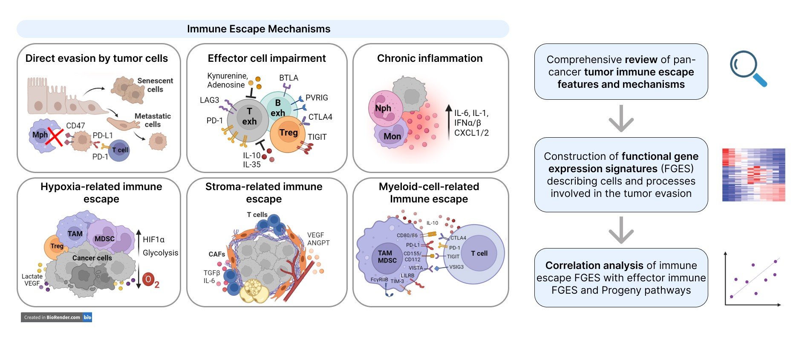
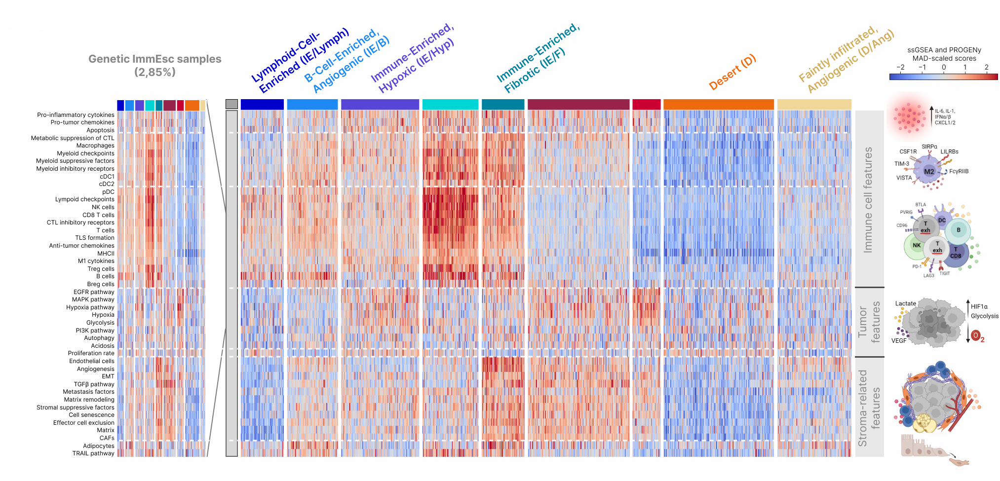
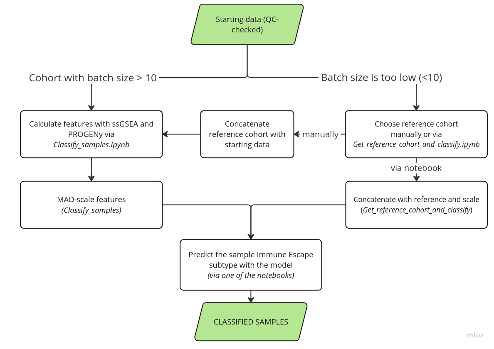

# Immune Escape Atlas as a practical tool for drug design and patient stratification in clinical trials

## Introduction

In recent years, a number of computational approaches provided different strategies to classify solid tumors based on the specific transcriptomic features of their tumor microenvironment (TME), predicting prognosis or elucidating responders to therapies. Still there is no unifying model that can account for different aspects of immune activity and tumor evasion within the same patient and guide development of novel immunotherapeutics. Tumor immune escape mechanisms, major causes of immunotherapy resistance, were also rarely included and intersected with TME states. In this study, we offered an approach to map a wide spectrum of known tumor IE mechanisms onto a large clinical cohort of cancer patients, harmonizing more than 37,000 patient samples, collected across 193 different datasets. Our findings discerned TME types that match existing approaches and are relevant to the developing TME-targeted therapies. We compared our TME classification framework to existing classifications and demonstrated a broadening method which allowed us to differentiate patients according to potential response to a number of targeted therapies. The proposed framework can be deployed by the medical and scientific community to interpret results of clinical trials, improve drug development and therapy decisions. 

## About the tool

Features used in the study are a collection of mechanisms describing tumor, immune and their interaction. Immune Escape mechanisms are an important addition to an already described set of mechanisms covered by other TME classification tools, like  [Molecular Functional Portraits](https://pubmed.ncbi.nlm.nih.gov/34019806/) or [Archetypes](https://pubmed.ncbi.nlm.nih.gov/34963056/).
 

Immune Escape Mechanisms covered in the study

We defined 9 TME types based on full feature set of 45 mechanisms for major immune escape strategies, which can be used to guide decision-making for the patient.

  

Identified TME types

The identified Immune Escape TME types are as follows:

| TME Type                         | Abbreviation | Description                                                                                                                                                                                                                                                                                                  |
| -------------------------------- | ------------ | ------------------------------------------------------------------------------------------------------------------------------------------------------------------------------------------------------------------------------------------------------------------------------------------------------------ |
| Lymphoid-Cell-Enriched           | IE/Lymph     | Prevalence of lymphoid cells over myeloid cells in TME composition with relatively low stromal components and low hypoxia                                                                                                                                                                                    |
| B-cell-enriched, Angiogenic      | IE/B         | High level of infiltration with both lymphoid and myeloid cells, with a certain increase in B cells, high BCR diversity and prevalence of CXCL9+ macrophages over SPP1+                                                                                                                                      |
| Immune-Enriched, Hypoxic         | IE/Hyp       | High immune cell infiltration with prevalence of myeloid cells and high levels of hypoxia, glycolysis, EGFR and MAPK signaling                                                                                                                                                                               |
| Highly Immune-Enriched, Inflamed | IE/Inf       | The highest immune infiltration, especially with lymphoid cells, extremely high expression of both lymphoid- and myeloid-cell-associated checkpoint molecules and the highest TCR and BCR diversity. CXCL9+ macrophages were prevalent according to deconvolution, while stroma and hypoxia signals were low |
| Immune-Enriched, Fibrotic        | IE/F         | High immune cell infiltration with the highest macrophage-to-lymphocyte ratio and high TCR and BCR diversity, high stroma-associated features (high cancer-associated fibroblasts (CAFs) content with prevalence of myCAFs, high angiogenesis), and highly upregulated TGFβ pathway                          |
| Fibrotic, Angiogenic, Myeloid    | F/Ang/Myel   | Low immune infiltration, mostly by SPP1+ macrophages, and high content of CAFs, especially myCAFs. TGF-β signaling was highly upregulated, angiogenesis and endothelial cell levels were increased in this TME type                                                                                          |
| Fibrotic, Hypoxic                | F/Hyp        | Minimal immune cell infiltration and very high hypoxia level, with upregulated EGFR and MAPK signaling. CAF and endothelial cell levels were significantly lower than in other fibrotic types                                                                                                                |
| Immune Desert                    | D            | Cluster was marked by the lowest immune cell infiltration and lowest presence of stroma components, with occasional hypoxia.                                                                                                                                                                                 |
| Faintly Infiltrated, Angiogenic  | D/Ang        | Low immune cell content (mostly lymphocytes) with increased TCR and BCR diversity compared to other desert types, moderate angiogenesis and endothelial cell levels.                                                                                                                                         |

Immune Escape class annotation for TCGA samples is in [data/TCGA_class_prediction.tsv](data/TCGA_class_prediction.tsv) ('IE_Class' column; rest — probabilities). Immune Escape features calculated for >37000 samples are in [data/Metacohort_full_scaled_features.tsv.gz](data/Metacohort_full_scaled_features.tsv.gz) 

## Citation
If software, data, and/or website are used in your publication, please cite [CITATION] and make a reference to this repository.

For more information visit [BostonGene’s Scientific portal](https://science.bostongene.com/tumor-portrait/)
## Setup
See the [SETUP.md](SETUP.md) to set up the environment. **It is highly recommended.** The following steps are performed using repo and the installed kernel; to clone:

    git clone git@github.com:BostonGene/Immune_Escape.git

## Samples classification

### Requirements for the samples
Sample is an Illumina RNA sequencing or microarray data of a human solid tumor biopsy in a format of dataframe in as tsv with genes as rows in HUGO format, samples as columns and values as logTPMs or log intensities. 

We recommend to use the model for the samples with high purity (>80% of tumor cells) and only for diagnoses used in the study, i.e. solid cancers except sarcomas. The following TCGA cohorts were used as a discovery cohort: BRCA, HNSC, THCA, LUAD, LUSC, KIRC, SKCM, PRAD, BLCA, STAD, LIHC, OV, CESC, KIRP, COAD, ESCA, UCEC, PAAD, PCPG, READ, UVM, ACC, KICH, UCS, CHOL. See [this page](https://gdc.cancer.gov/resources-tcga-users/tcga-code-tables/tcga-study-abbreviations) to decipher abbreviations. However, we tested the model to additionally classify unused diagnoses: Glioblastoma, Glioma, and Astrocytoma and showed that it was clinically relevant. 

We described how to get the required data and perform quality control (QC) in the [DATA_AND_QC.md](DATA_AND_QC.md).
### Classification task

Starting with identified batches of data, QC-checked, with removed outliers, and in a proper format, one can calculate and scale features. The are two ways: 
1) With sufficient sample size in a batch (10 as a minimal cutoff, however, the more is always the better, with low variety 10 also can be insuffiecient) — use [Classify_samples.ipynb](Classify_samples.ipynb);
2) With insufficient sample size in a batch — use [Get_reference_cohort_and_classify.ipynb](Get_reference_cohort_and_classify.ipynb) to find reference cohort out of metacohort, or get one manually and use [Classify_samples.ipynb](Classify_samples.ipynb).

**The workflow is as follows:**
  

Diagram for sample classification

[Classify_samples.ipynb](Classify_samples.ipynb) — notebook with example classification for the cohort with batch size > 10.

[Get_reference_cohort_and_classify.ipynb](Get_reference_cohort_and_classify.ipynb) — notebook with additional step for finding the reference. Not that we use raw ssGSEA and PROGENy to find nearest batch, which works as well as via expression data; we show it in [test_data/Test_mapper.ipynb](test_data/Test_mapper.ipynb).
